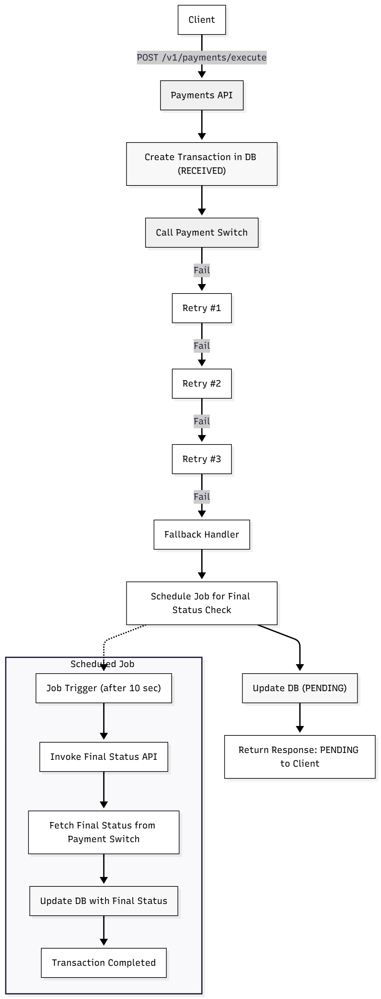

# 💳 Resilient Payment System

A modular demo project showcasing **fault-tolerant payment orchestration** using **Spring Boot**, **Resilience4j**, and **JobRunr**, with a simulated **payment switch** built on **WireMock**.

This project demonstrates how to design **resilient APIs** capable of recovering gracefully from transient failures, retries, and delayed processing.

---

## 🧩 Project Modules

### 1. `payments-api`
> The core Spring Boot application exposing REST endpoints for payment execution and reconciliation.

#### Responsibilities:
- Accept client payment requests
- Trigger downstream calls to the **Payment Switch**
- Apply **Resilience4j retry policies** on transient errors
- Use **JobRunr** for delayed or background jobs (e.g., reconciliation)
- Persist payment states using Spring Data repositories
- Provide **Swagger/OpenAPI documentation** for all APIs
---

### 2. `payments-switch`
> A standalone **WireMock** server simulating real-world payment switch behavior.

#### Responsibilities:
- Expose mock endpoints for:
    - Creating payments
    - Returning final payment statuses
- Randomly simulate transient errors (`429 Too Many Requests`, `503 Service Unavailable`, etc.)
- Help test retry, fallback, and delay handling in `payments-api`.

You can containerize it using the provided **Dockerfile**.

---

## 📘 API Documentation

The `payments-api` and `payments-switch` modules expose  RESTful API(s) to initiate and reconcile and retrieve payment transactions.  
All endpoints are documented and testable through **Swagger UI**.

---

### 🔗 Accessing the Docs

Once the application starts, open your browser and visit:

- **Swagger UI(Payments API):** [http://localhost:8080/swagger-ui.html](http://localhost:8080/swagger-ui.html)
- **OpenAPI JSON Spec:** [http://localhost:8080/v3/api-docs](http://localhost:8080/v3/api-docs)
- **Java Docs:** [API Docs](https://karthik192000.github.io/resilient-payments-demo/)
- **Swagger UI(Payments Switch):**[http://localhost:8089/swagger-ui.html](http://localhost:8089/swagger-ui.html)

---

## 🔄 Data Flow Diagram

## 🧠 Core Frameworks Explained

### 🛡️ Resilience4j
**Resilience4j** is a lightweight fault-tolerance library designed for Java 8+ and functional programming.  
It provides ready-to-use resilience patterns to make microservices **more robust and stable** under failure.

**Core Features:**
- **Retry** — Automatically retries failed calls based on configurable conditions (e.g., HTTP 5xx, 429).
- **Circuit Breaker** — Prevents cascading failures by “opening” the circuit after consecutive failures.
- **Rate Limiter** — Controls request throughput to prevent overloading downstream systems.
- **Bulkhead** — Isolates critical resources to avoid complete system failure.
- **TimeLimiter** — Enforces timeouts for slow external calls.

📘 **Official Docs:** [https://resilience4j.readme.io/](https://resilience4j.readme.io/)  
📦 **Maven:** `io.github.resilience4j:resilience4j-spring-boot3`

In this project, **Resilience4j Retry** is used to handle transient switch errors (like HTTP 429 or 503) with exponential backoff and conditional retries.

---

### ⚙️ JobRunr
**JobRunr** is a modern background job scheduler for Java.  
It allows you to run, schedule, and monitor background jobs with persistence and a built-in dashboard — **without the complexity of cron setups**.

**Key Capabilities:**
- **Background Jobs** — Run tasks asynchronously in the background.
- **Delayed Scheduling** — Schedule jobs for a specific future time.
- **Recurring Jobs** — Define periodic tasks using CRON expressions.
- **Distributed Execution** — Run jobs across multiple instances for scalability.
- **Dashboard** — Web-based interface to track jobs and executions.

📘 **Official Docs:** [https://www.jobrunr.io/en/documentation/](https://www.jobrunr.io/en/documentation/)  
📦 **Maven:** `org.jobrunr:jobrunr-spring-boot-starter`

In this project, JobRunr is used to **schedule a delayed reconciliation job** that checks the final payment status after an initial API call.

---

## 🎯 Motivation: Why Integrate Resilience4j and JobRunr Together?

Modern payment systems must deal with **unreliable downstream dependencies** — APIs may fail, delay, or return inconsistent statuses due to network congestion, rate limits, or transient issues.

This project integrates **Resilience4j** and **JobRunr** to demonstrate a **resilient end-to-end payment workflow**:

1. **Immediate Resilience (Resilience4j)**
    - When the payment switch responds with temporary errors (429/503), the system automatically retries the request based on rules defined in a custom `PaymentsRetryPredicate`.
    - This ensures transient failures don’t immediately break the flow.

2. **Deferred Resilience (JobRunr)**
    - Some switch operations complete asynchronously or need reconciliation later.
    - Instead of blocking the client, a **JobRunr background job** (`PaymentsReconJob`) is scheduled to poll for the final status after a delay (e.g., 10 seconds).

3. **Outcome:**
    - The API responds quickly to the client while the background job ensures eventual consistency.
    - This architecture models real-world systems like **card payments, fund transfers, or transaction gateways** where **resilience + delayed processing** are critical.

**In essence:**
> 🧩 *Resilience4j keeps the system alive in the moment; JobRunr ensures completion later.*

---

